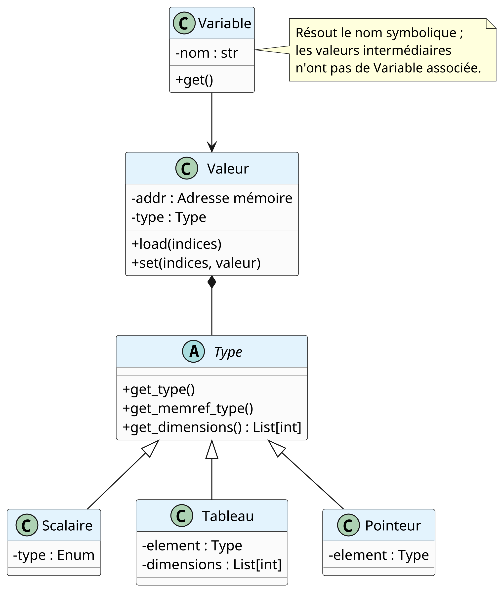
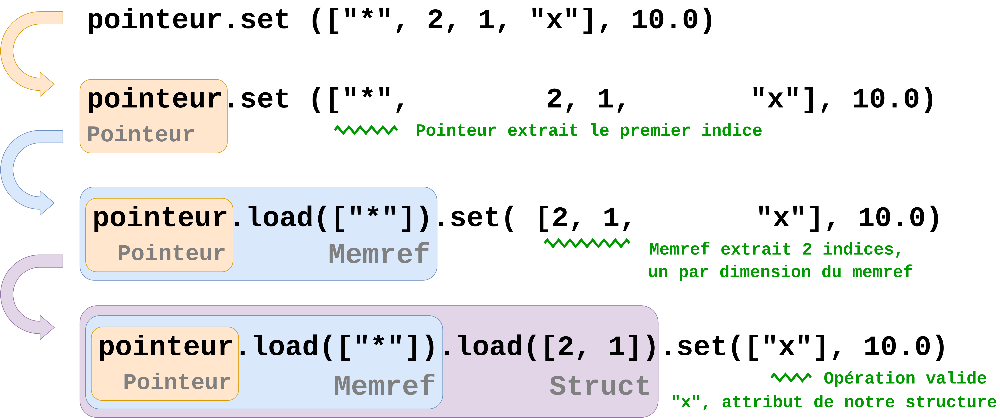

Types and values
================

Overview
--------

jsonMLIR deliberately separates a *type* (``Ty``) from a *value* (``Val``).
This distinction is important because the compiler handles two different kinds
of information:

* ``TyNode`` describes the logical data: a scalar, a pointer, a memref, a
  buffer, or a structure. It contains no address and can therefore be reused
  in function signatures and nested type descriptions.
* ``ValNode`` describes one occurrence of that data during code generation. It
  couples a ``TyNode`` with an MLIR SSA value or memory address and implements
  operations such as ``load``, ``store``, and ``get_SSA``.
* ``Var`` resolves a source-level name through the variable heap and forwards
  accesses to the associated ``ValNode``. Intermediate values produced while
  traversing a pointer or aggregate do not need a source-level variable.

The split also distinguishes the logical type from its storage representation.
Since value are not mutable in MLIR, jsonMlir use memref to store and edit them.
For a scalar, ``TyScalar.get_type()`` returns ``i64`` or ``f64``, whereas
``TyScalar.get_memref_type()`` returns the zero-dimensional ``memref`` used to
provide mutable storage.

Chain of Responsibility for nested accesses
---------------------------------------------

Nested data can be accessed with one uniform operation even when every level
has a different representation. The value receives a sequence of indices and
consumes the part it understands before delegating the remaining indices to
the value it loads. In this project, this is an application of the **Chain of
Responsibility** design pattern: each value handler either completes the
request or passes it to the next handler without the caller having to know the
whole type chain.

For example, an access to a pointer to a two-dimensional collection of
structures can be written as:

.. code-block:: python

   pointer.store(["*", 2, 1, "x"], source)

The request is resolved as follows:

1. ``ValPtr`` consumes ``"*"``, converts the raw address to a memref, and
   creates a value for the pointed-to type.
2. ``ValMemref`` or ``ValBuffer`` consumes the collection indices ``2`` and
   ``1`` and creates a value for the selected element.
3. ``ValStruct`` consumes ``"x"`` and creates the field view.
4. The terminal value performs the MLIR load or store once no indices remain.

The same delegation is used by ``load``. The public method normalizes integer
indices to SSA values, then each private ``_load`` or ``_store`` implementation
checks its own invariants. For example, ``ValPtr`` accepts only ``"*"``, a
memref consumes exactly its dimensions, and a structure validates field names.
This localizes representation-specific logic and prevents a single global
dispatcher from having to know every combination of pointer, array, buffer,
and structure.

This pattern also makes the hierarchy extensible. A new value kind only needs
to implement the abstract ``ValNode`` interface and define how many indices it
consumes before delegating. The factory remains responsible for constructing
that value, while existing handlers continue to work for the other parts of a
nested access.

Ty nodes
~~~~~~~~

.. autoclass:: jsonmlir.variables.ty.ty.TyNodeBase
.. autoclass:: jsonmlir.variables.ty.ty_scalar.TyScalar
.. autoclass:: jsonmlir.variables.ty.ty_struct.TyStruct
.. autoclass:: jsonmlir.variables.ty.ty_memref.TyMemref
.. autoclass:: jsonmlir.variables.ty.ty_buffer.TyBuffer
.. autoclass:: jsonmlir.variables.ty.ty_ptr.TyPtr
.. autoclass:: jsonmlir.variables.ty.ty_SSA.TySSA
.. autoclass:: jsonmlir.variables.ty.ty_SOA.TySOA
.. autoclass:: jsonmlir.variables.ty.ty_mdspan.TyMdspan
.. autoclass:: jsonmlir.variables.ty.ty_not_supported.TyNotSupported

.. autofunction:: jsonmlir.variables.ty.ty.dump_ty
.. autofunction:: jsonmlir.variables.ty.ty.parse_ty

Type-specific helpers
^^^^^^^^^^^^^^^^^^^^^

The following helpers are specific to a storage layout or a type family. The
common type interface is intentionally not repeated here.

``TyMemref`` and ``TyBuffer`` expose their logical element counts. A buffer
also knows its byte size, which is useful when a structure is serialized into
an ``i8`` memref.

.. automethod:: jsonmlir.variables.ty.ty_memref.TyMemref.get_n_elements
.. automethod:: jsonmlir.variables.ty.ty_buffer.TyBuffer.get_n_elements
.. automethod:: jsonmlir.variables.ty.ty_buffer.TyBuffer.get_bytes_size

``TyMdspan`` can report its extent and materialize the descriptor layout used
to access its pointer and size fields.

.. automethod:: jsonmlir.variables.ty.ty_mdspan.TyMdspan.get_n_elements
.. automethod:: jsonmlir.variables.ty.ty_mdspan.TyMdspan.get_struct

``TySOA`` stores the number of structure elements separately from the byte
sizes of its columns.

.. automethod:: jsonmlir.variables.ty.ty_SOA.TySOA.get_count
.. automethod:: jsonmlir.variables.ty.ty_SOA.TySOA.get_sizes

Val nodes
~~~~~~~~~

.. autoclass:: jsonmlir.variables.val.val.ValNode
.. autoclass:: jsonmlir.variables.val.val_scalar.ValScalar
.. autoclass:: jsonmlir.variables.val.val_struct.ValStruct
.. autoclass:: jsonmlir.variables.val.val_memref.ValMemref
.. autoclass:: jsonmlir.variables.val.val_buffer.ValBuffer
.. autoclass:: jsonmlir.variables.val.val_ptr.ValPtr
.. autoclass:: jsonmlir.variables.val.val_SSA.ValSSA
.. autoclass:: jsonmlir.variables.val.val_SOA.ValSOA
.. autoclass:: jsonmlir.variables.val.val_mdspan.ValMdspan

Value-specific helpers
^^^^^^^^^^^^^^^^^^^^^^

These methods operate on the runtime address carried by a value. They are
separate from the common ``ValNode`` access interface and are listed here only
when they provide a capability specific to a representation.

``ValMemref`` and ``ValBuffer`` expose the element type and dimensions of the
underlying view. ``ValBuffer.get_size`` converts a serialized byte-buffer size
to a number of structure elements; it can return an MLIR SSA value when the
size is dynamic.

.. automethod:: jsonmlir.variables.val.val_memref.ValMemref.get_base
.. automethod:: jsonmlir.variables.val.val_buffer.ValBuffer.get_base
.. automethod:: jsonmlir.variables.val.val_buffer.ValBuffer.get_size

``ValBuffer.build_view`` is the main buffer-specific operation. It creates a
strided view for one structure field by applying the field offset and the
structure stride, then wraps the resulting memref in the appropriate value
class. ``ValSOA.init_from`` uses it to build one column per field.

.. automethod:: jsonmlir.variables.val.val_buffer.ValBuffer.build_view

``ValStruct`` can report its serialized size and turn a named field into a
typed value. ``ValMdspan`` provides the corresponding descriptor view.

.. automethod:: jsonmlir.variables.val.val_struct.ValStruct.get_size
.. automethod:: jsonmlir.variables.val.val_struct.ValStruct.get_field
.. automethod:: jsonmlir.variables.val.val_mdspan.ValMdspan.get_base
.. automethod:: jsonmlir.variables.val.val_mdspan.ValMdspan.get_struct

.. automodule:: jsonmlir.variables.factory
   :members:

.. automodule:: jsonmlir.variables.memory
   :members:

